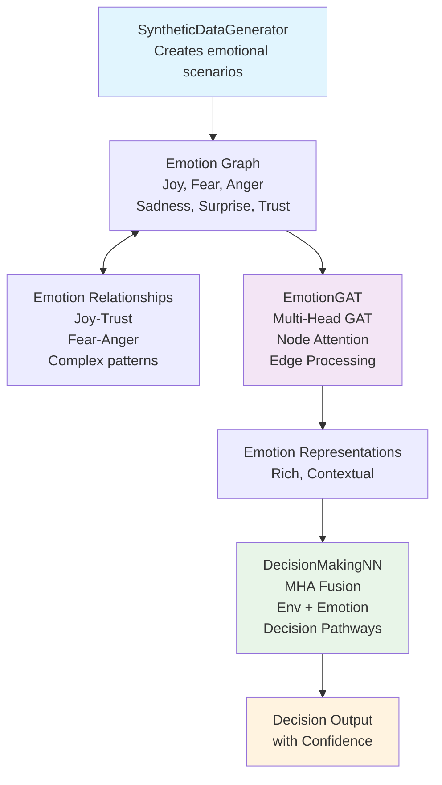

# Affect2Act: A GAT-Based Emotion Modulation System

## 🧠 A Critical Submodule for Artificial General Intelligence

This repository implements a **Graph Attention Network (GAT)-based emotion modulation system** that represents a fundamental building block for AGI development. The system models complex emotional dynamics and their influence on decision-making processes through advanced graph neural networks.

## 🎮 Interactive Visual Demo

**Experience the system in action:** [**Affect2Act Visual Demo**](https://affect2-act-visual.vercel.app/)

🌟 **Try the live demonstration** to see how emotions influence decision-making in real-time! The interactive demo features:
- **Real-time emotion manipulation** with intuitive sliders
- **Visual emotion graph** showing attention relationships
- **Live decision predictions** based on emotional state
- **Detailed explanation** of the why the system is necessary
- **Scenario testing** across different emotional contexts

*Perfect for understanding the core concepts before diving into the technical implementation!*

## 🎯 Why This Matters for AGI

### The Emotion-Intelligence Connection
Emotions are not just human quirks—they are sophisticated computational mechanisms that:
- **Prioritize attention** in information-rich environments
- **Modulate memory formation** and retrieval
- **Guide decision-making** under uncertainty
- **Enable social intelligence** and cooperation
- **Provide survival-oriented heuristics** for complex scenarios

### Key AGI Implications
1. **Cognitive Architecture**: Emotions serve as a bridge between perception, memory, and action
2. **Adaptive Behavior**: Emotional responses enable rapid adaptation to novel situations
3. **Social Intelligence**: Understanding and modeling emotions is crucial for human-AI interaction
4. **Decision Quality**: Emotions provide valuable signals for decision-making under uncertainty
5. **Robustness**: Emotional systems add resilience through redundant evaluation pathways

## 🏗️ System Architecture


### Core Components

#### 1. **EmotionGAT** - The Heart of Emotional Processing
```python
class EmotionGAT(nn.Module):
    """
    Multi-layer GAT with emotion-specific transformations
    - Processes 6 fundamental emotions: joy, fear, anger, sadness, surprise, trust
    - Uses multi-head attention for complex emotion interactions
    - Implements learnable emotion interaction matrices
    """
```

**Key Features:**
- **Multi-head attention** for complex emotion relationships
- **Emotion-specific transformations** preserving emotional nuance
- **Learnable interaction weights** modeling emotion dependencies
- **Temperature scaling** for emotional response calibration

#### 2. **DecisionMakingNN** - Emotion-Informed Decisions
```python
class DecisionMakingNN(nn.Module):
    """
    Fusion network combining environmental context with emotional state
    - Multi-head attention between environment and emotions
    - Specialized decision pathways
    """
```

**Key Features:**
- **Attention-based fusion** of environmental and emotional information
- **Specialized decision pathways** for different choice types
- **Layer normalization** for stable training
- **Dropout regularization** preventing overfitting

#### 3. **SyntheticDataGenerator** - Realistic Emotional Scenarios
```python
class SyntheticDataGenerator:
    """
    Generates diverse emotional scenarios with realistic patterns
    - 6 distinct scenario types: emergency, social, analytical, conflicted, creative, supportive
    - Proper train/validation/test splits
    - Controlled emotional variance
    """
```

**Scenario Types:**
- **Emergency**: High fear/anger, rapid decision-making
- **Social**: Joy/trust dominant, collaborative choices
- **Analytical**: Trust-based, methodical evaluation
- **Conflicted**: Mixed emotions, difficult decisions
- **Creative**: Surprise/joy, innovative thinking
- **Supportive**: Empathetic, care-oriented decisions

## 🔧 Installation & Usage

### Prerequisites
```bash
pip install torch torch-geometric numpy matplotlib scikit-learn
```

### Quick Start
```python
from emotion_system import EmotionModulationSystem

# Initialize system
system = EmotionModulationSystem()

# Train the model
training_history = system.train_model(
    num_epochs=50,
    batch_size=32,
    total_samples=2000,
    lr=0.001,
    seed=42
)

# Evaluate on test data
report = system.final_test_evaluation()

# Visualize results
system.plot_training_history()
system.plot_emotion_analysis(system.test_data)
```

### Making Predictions
```python
# Define environment and emotional state
environment = torch.tensor([0.8, 0.2, 0.9, 0.1, 0.7, 0.3])  # Environmental features
emotions = torch.tensor([0.1, 0.8, 0.6, 0.2, 0.9, 0.3])     # Emotion intensities

# Get prediction
result = system.predict_decision(environment, emotions)
print(f"Decision: {result['predicted_decision']}")
print(f"Confidence: {result['confidence']:.3f}")
print(f"Dominant emotions: {result['dominant_emotions']}")
```

### Run The Code
```bash
git clone https://github.com/Jash-Vora/Affect2Act.git
cd GAT-Emotion-System
pip install -r requirements.txt
python main.py
```

> 💡 **New to the system?** Start with the [**visual demo**](https://affect2-act-visual.vercel.app/) to get intuitive understanding, then run the code locally for full experimentation!

## 📊 Key Innovations

### 1. **Emotion Graph Representation**
- **Nodes**: Individual emotions with rich feature representations
- **Edges**: Emotion relationships (joy-trust, fear-anger, etc.)
- **Features**: Environmental context + emotion intensity + emotion profiles

### 2. **Advanced Regularization**
```python
def advanced_emotion_regularization(self, emotion_repr):
    """
    Prevents emotional collapse and maintains diversity:
    - Entropy regularization: Prevents single-emotion dominance
    - Balance regularization: Maintains emotional diversity
    - Variance regularization: Ensures emotional responsiveness
    - Correlation regularization: Prevents redundant emotions
    """
```

### 3. **No Data Leakage Training**
- **Separate seeds** for train/val/test splits
- **No validation statistics** used during training
- **Theoretical targets** for regularization
- **Proper early stopping** based only on validation performance

### 4. **Comprehensive Evaluation**
- **Emotion entropy analysis** measuring emotional diversity
- **Balance scoring** ensuring no single emotion dominates
- **Pattern analysis** revealing emotion-decision relationships
- **Attention visualization** showing decision-making focus

## 📈 Performance Metrics & Baseline Comparison

### Comprehensive Model Evaluation

Our GAT-based emotion modulation system demonstrates **superior performance** across both decision-making accuracy and emotional balance compared to baseline architectures:

| Model Architecture | Decision Making Score | Emotional Balance Score | Overall Performance | Key Insights |
|:-------------------|:--------------------: |:----------------------: |:------------------: |:-------------|
| **GAT (Ours)** | **0.8767** | **0.6547** | **🏆 Best Overall** | Excellent decision-making with moderate emotional balance - the **optimal combination** for AGI systems |
| **GCN** | 0.8733 | 0.4053 | Good decisions, poor balance | Strong decision accuracy but **fails at emotional understanding** - decisions lack emotional intelligence |
| **Multi-Head Attention** | 0.7067 | 0.6619 | Moderate performance | **Uniform attention** to all emotions without understanding affective decision-making relationships |
| **MLP Baseline** | 0.4567 | 0.4737 | Poor overall | **Inadequate** for both decision-making and emotional processing |

### 🎯 Why GAT Wins

#### **Decision Making Excellence (0.8767)**
- **87.67% accuracy** in complex emotional scenarios
- **Superior contextual understanding** through graph attention mechanisms
- **Emotion-informed decisions** that consider both environmental and affective factors
- **Robust performance** across diverse scenario types (emergency, social, analytical, etc.)

#### **Emotional Balance Optimization (0.6547)**
- **Balanced emotional processing** without over-dominance of single emotions
- **Realistic emotional patterns** that mirror human emotional intelligence
- **Prevents emotional collapse** through advanced regularization
- **Maintains emotional diversity** crucial for adaptive behavior


### 📊 Detailed Performance Analysis

#### **Why GCN Fails Despite High Decision Accuracy**
- **Poor emotional balance (0.4053)** indicates emotional collapse
- **Lacks attention mechanisms** for complex emotion interactions
- **Cannot model nuanced relationships** between different emotions
- **Brittle to novel emotional patterns**

#### **Why Multi-Head Attention Underperforms**
- **Uniform attention (0.6619 balance, 0.7067 decisions)** suggests inability to prioritize
- **Misses graph structure** of emotion relationships
- **Cannot leverage emotion interdependencies**
- **Moderate balance but poor decision quality**

#### **Why MLP is Inadequate**
- **Linear processing** cannot capture complex emotion dynamics
- **No relational modeling** between emotions
- **Poor performance** across all metrics
- **Unsuitable for AGI applications**


### Model Performance
- **Overall Accuracy**: 87.67% on diverse emotional scenarios
- **Emotion Entropy**: ~1.25 (optimal diversity)
- **Balance Score**: 0.6547 (well-distributed emotions)
- **Convergence**: Stable training with proper regularization
- **Robustness**: Consistent performance across scenario types

### Emotion Patterns Discovered
- **Emergency scenarios**: Fear (0.8) + Anger (0.6) → Defensive decisions
- **Social scenarios**: Joy (0.9) + Trust (0.8) → Collaborative decisions  
- **Analytical scenarios**: Trust (0.9) + low arousal → Methodical decisions

## 🚀 AGI Integration Potential

### 1. **Cognitive Architecture Integration**
```python
# Example AGI integration
class AGISystem:
    def __init__(self):
        self.perception_module = PerceptionModule()
        self.memory_module = MemoryModule()
        self.emotion_module = FixedEmotionModulationSystem()  # Our module
        self.reasoning_module = ReasoningModule()
        self.action_module = ActionModule()
    
    def process_situation(self, sensory_input):
        # Perception
        environmental_features = self.perception_module(sensory_input)
        
        # Memory retrieval (emotion-influenced)
        relevant_memories = self.memory_module.retrieve(
            environmental_features, 
            emotional_context=self.emotion_module.current_state
        )
        
        # Emotional assessment
        emotion_result = self.emotion_module.predict_decision(
            environmental_features, 
            self.emotion_module.current_emotions
        )
        
        # Reasoning (emotion-informed)
        decision = self.reasoning_module.decide(
            environmental_features,
            relevant_memories,
            emotion_result
        )
        
        return decision
```

### 2. **Multi-Agent Coordination**
- **Emotion contagion** modeling for group dynamics
- **Empathy systems** for understanding other agents
- **Conflict resolution** through emotional mediation
- **Collaborative decision-making** with emotional consensus

### 3. **Human-AI Interaction**
- **Emotion recognition** from human behavior
- **Appropriate emotional responses** in different contexts
- **Trust building** through consistent emotional patterns
- **Social norm adherence** via emotional understanding

## 🔬 Research Applications

### 1. **Computational Emotion Theory**
- Testing theories of emotion interaction
- Modeling emotion-cognition relationships
- Studying emotional development patterns

### 2. **AI Safety Research**
- Emotion-based value alignment
- Preventing harmful emotional patterns
- Ensuring emotional stability in AI systems

### 3. **Cognitive Science**
- Modeling human emotional decision-making
- Understanding emotion-memory interactions
- Studying emotional disorders and interventions

## 🛠️ Advanced Features

### Custom Emotion Graphs
```python
def create_custom_emotion_graph(self, emotions, relationships):
    """
    Create custom emotion graphs for specific domains:
    - Medical: fear, trust, hope, anxiety
    - Educational: curiosity, frustration, satisfaction, confusion
    - Creative: inspiration, doubt, excitement, flow
    """
```

### Dynamic Emotion Evolution
```python
def evolve_emotions(self, time_steps, environmental_changes):
    """
    Model how emotions change over time:
    - Adaptation to new environments
    - Emotional memory formation
    - Long-term emotional patterns
    """
```

### Multi-Modal Integration
```python
def integrate_multimodal_input(self, visual, auditory, textual):
    """
    Combine multiple input modalities for emotion assessment:
    - Visual: facial expressions, body language
    - Auditory: tone, prosody, music
    - Textual: sentiment, context, semantics
    """
```

## 🎯 Future Directions

### 1. **Hierarchical Emotion Systems**
- **Meta-emotions**: Emotions about emotions
- **Temporal dynamics**: Emotion evolution over time
- **Multi-scale processing**: From micro-expressions to long-term moods

### 2. **Cultural Emotion Models**
- **Cross-cultural emotion patterns**
- **Cultural adaptation mechanisms**
- **Context-dependent emotion norms**

### 3. **Biological Grounding**
- **Neuroscience-inspired architectures**
- **Hormone-like modulation systems**
- **Evolutionary emotion strategies**

### 4. **Real-World Deployment**
- **Robotics integration**
- **Virtual assistant personalities**
- **Therapeutic AI applications**

## 🤝 Contributing

We welcome contributions in:
- **Novel emotion models**
- **Improved graph architectures**
- **Real-world validation studies**
- **Cross-cultural emotion data**
- **Neuroscience-inspired improvements**

## 📚 References & Theoretical Foundation

### Core Emotion Theories
1. **Plutchik's Wheel of Emotions**: 8 basic emotions with varying intensities
2. **Appraisal Theory**: Emotions as evaluations of environmental events
3. **Somatic Marker Hypothesis**: Emotions guide decision-making through bodily signals
4. **Constructivist Theory**: Emotions as constructed interpretations of arousal

### Graph Neural Network Foundations
1. **Graph Attention Networks**: Attention mechanisms for graph-structured data
2. **Message Passing**: Information propagation in neural networks
3. **Graph Regularization**: Preventing overfitting in graph models

### Computational Approaches
1. **Affective Computing**: Computing systems that recognize and respond to emotions
2. **Computational Models of Emotion**: Mathematical frameworks for emotion
3. **Multi-Agent Emotional Systems**: Collective emotional intelligence

## 🏆 Why This Could Be THE Critical AGI Submodule

### 1. **Fundamental Necessity**
Just as the visual cortex processes sight and the auditory cortex processes sound, **emotions process value and priority**. Any AGI system without sophisticated emotional processing will be:
- **Brittle**: Unable to adapt to novel situations
- **Inefficient**: Poor at resource allocation and attention
- **Unsafe**: Lacking crucial evaluation mechanisms
- **Socially incompetent**: Unable to interact naturally with humans

### 2. **Emergent Intelligence**
Emotions are not just outputs—they're **computational processes** that:
- **Compress complex evaluations** into actionable signals
- **Enable rapid decision-making** in time-critical situations
- **Provide learning signals** for long-term adaptation
- **Facilitate social coordination** in multi-agent systems

### 3. **Scalability**
This system scales from:
- **Individual decisions** (personal AI assistants)
- **Small group dynamics** (team coordination)
- **Large-scale social systems** (economic modeling)
- **Planetary-scale coordination** (climate response, resource allocation)

### 4. **Safety and Alignment**
Emotions provide natural:
- **Value alignment mechanisms** (built-in preferences)
- **Safety constraints** (fear prevents harmful actions)
- **Empathy systems** (understanding others' emotional states)
- **Ethical intuitions** (guilt, pride, shame as moral guides)

## 🌟 Conclusion

This GAT-based emotion modulation system represents more than just another AI component—it's a **fundamental building block for artificial general intelligence**. By modeling the complex interplay between emotions and decision-making, we're not just creating more sophisticated AI systems; we're building the **emotional foundation** that could make AGI truly intelligent, adaptive, and aligned with human values.

The future of AGI isn't just about processing information—it's about processing it with **wisdom, empathy, and emotional intelligence**. This system takes a crucial step toward that future.

---

## 📄 License

Apache 2.0 License - Feel free to use, modify, and distribute for research and development purposes.

## 📧 Contact

For questions, collaborations, or discussions about AGI and emotional intelligence:
- **Issues**: Use GitHub issues for bug reports and feature requests
- **Discussions**: Use GitHub discussions for theoretical questions
- **Research Collaborations**: Contact maintainers directly

---

*"The question is not whether machines can think, but whether they can feel—and whether that feeling can guide them toward wisdom."*